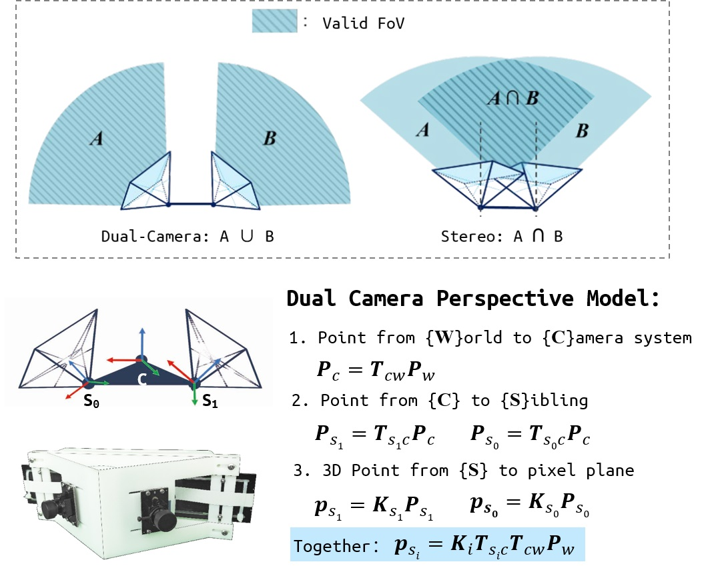

# ORB-SLAM2-DualCam  

# 1. Introduction
<font color=#FF7F50>Backup of my work & M.S dissertation at Shanghai Jiao Tong University. </font>  

ORB-SLAM2-DualCam is a real-time SLAM library implemented for the **Dual Camera Model** (2 cameras without common-view). The system modifies the state-of-the-art [ORB-SLAM2](https://github.com/raulmur/ORB_SLAM2) to run on dual pinhole camera model. Our Dual Camera SLAM (DCS) is able to compute the camera **metric trajectory (Pose)** and recover a sparse **metric structure (Map)** of the environmen in real-time.  Owing to the lack of common-view, dual camera SLAM cannot use the classical stereo initialization to link 2 cameras in map and to retrive metric scale. The initialization procedures are thus divided in to four sequential parts: 1) monocular initialization, 2) mono SLAM while searching for cross-camera relocalization in the mean time, 3) dual initialiazation and scaling map,  4) gloabal BA.   In conclusion,  DCS merges the observations from the array of cameras, uses sparse visual features to generate 3D map points, retrieves metric scale in virtue of the camera extrinsic calibrations, optimizes local map in a graph structure and estimates system status inside the local map. Besides, the relocalizaton and loop closure are also implemented in DCS to make it as a complete SLAM system.  Our DCS can also be extend to multiple camera system, in which the common-view between each camera is not complustory thus the field of view is more widened.    

<div align="center">
    
</div>

We provide Demo on [[YouTube](https://www.youtube.com/watch?v=MhrrnwHUnL0)] and [[bilibili](https://www.bilibili.com/video/av69906130)].   
And example of our self-collected video sequence at [[Google Drive](https://drive.google.com/file/d/1cZVqX36viThrwVyiRhUjFG1vOZTjpWCq/view?usp=sharing)] and [[百度云](https://pan.baidu.com/s/1sL8lWkmoSWgwRjCShQ1DfQ)](`i871`).   

# 2. Prerequisites
We have tested the library in  **Ubuntu 16.04**. A powerful computer (e.g. i7) will ensure real-time performance and provide more stable and accurate results.
## C++11 or C++0x Compiler
We use the new thread and chrono functionalities of C++11.

## Pangolin
We use [Pangolin](https://github.com/stevenlovegrove/Pangolin) for visualization and user interface. Dowload and install instructions can be found at: https://github.com/stevenlovegrove/Pangolin.

## OpenCV
We use [OpenCV](http://opencv.org) to manipulate images and features. Dowload and install instructions can be found at: http://opencv.org.   
**Tested with OpenCV 3.3（installed along with ros-kinetic-full）**.

## Eigen3
Required by g2o (see below). Download and install instructions can be found at: http://eigen.tuxfamily.org. **Required at least 3.1.0**.

## DBoW2 and g2o (Included in Thirdparty folder)
We use modified versions of the [DBoW2](https://github.com/dorian3d/DBoW2) library to perform place recognition and [g2o](https://github.com/RainerKuemmerle/g2o) library to perform non-linear optimizations. Both modified libraries (which are BSD) are included in the *Thirdparty* folder.  **NOTICE** : The g2o library is different from the one in ORB-SLAM2 due to we add edges that support dual camera pose.   

# 3. Building ORB-SLAM2-DualCam library and examples  

Clone the repository:  
```  
git clone https://github.com/lixiny/ORB-SLAM2-DualCam.git
```   
We provide a script `build_project.sh` to build the *Thirdparty* libraries and *ORB-SLAM2-DualCam*. Please make sure you have installed all required dependencies (see section 2). Execute:
```
cd ORB_SLAM2-DualCam
chmod +x build_project.sh
./build_project.sh
```
This will create **libORB_SLAM2_DualCam.so**  at `lib` folder and the executables at `./build/Dual` folder   

# 4. Test on examples    
1. download our examples video: `indoor_lab_loop.avi` from  at [[Google Drive](https://drive.google.com/file/d/1cZVqX36viThrwVyiRhUjFG1vOZTjpWCq/view?usp=sharing)] or [[百度云](https://pan.baidu.com/s/1sL8lWkmoSWgwRjCShQ1DfQ)](`i871`), and put it in this directory. 
2. download Vocabulary File `ORBvoc` from `Vocabulary/download_link.txt`
3. and execute the followling command 
```
./build/Dual/dual_slam_video  Vocabulary/ORBvoc.bin  Dual-LenaCV.yaml  indoor_lab_loop.avi
```   

# 5. Processing your own sequences
// TODO
